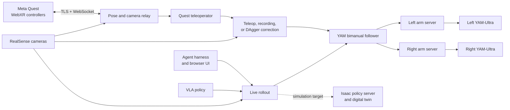
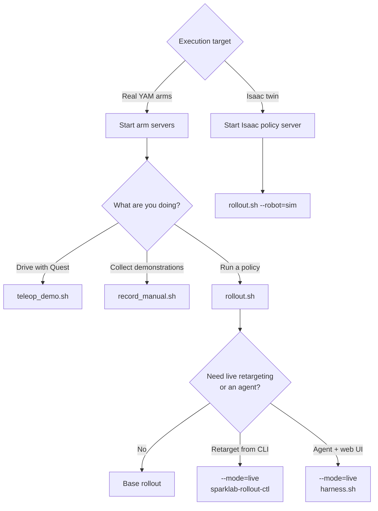

# sparklab-robotics

SparkLab's robotics stack: Meta Quest VR teleoperation, a camera/pose relay,
[LeRobot](https://github.com/huggingface/lerobot) `Robot`/`Teleoperator`
plugins for the lab's robots, an Isaac digital twin, and a web harness for
putting a high-level agent in front of a low-level VLA.

First robot: the bimanual [i2rt YAM-Ultra](https://github.com/i2rt-robotics/i2rt).

Design rationale, measured constraints and the reasoning behind the layout are
in [`DESIGN.md`](DESIGN.md).

## System at a glance



The arm servers are the only processes that touch CAN or own motor torque.
The relay, teleoperator, recorder, rollout, and harness remain replaceable
clients. A camera can have only one owner at a time: the relay owns it for
teleop preview, while recording and rollout open it through the robot client.

## Layout

```
src/lerobot_robot_sparklab/          the LeRobot plugin distribution
├── relay/      WebSocket relay + WebRTC camera streams + the WebXR page
├── quest/      Quest input: xr_frame subscription, staleness, button mapping
├── core/       Clutch-relative pose mapping with absorbing reach limits
├── cameras/    RealSense calibration, presets, intrinsics export
├── harness/    Web UI + REST for driving the VLA from a high-level agent
├── rollout/    A rollout plus a control port, and a REPL to drive it
├── tools/      No-hardware dry-run/inspection utilities
└── robots/
    └── yam_ultra/   kinematics, IK, hardware bridge, teleoperator, rig config

src/sparklab_sim/    the Isaac twin — scene building, rendering, and a policy
                     server the rollout talks to over HTTP. Its own interpreter.

scripts/             reusable workflows (rollout, record, teleop, health, analysis)
```

Everything under `robots/` is specific to one arm; everything above it is
shared. `rollout/` drives hardware and the twin alike — only `--robot.type`
differs.

## Install

```bash
conda create -n robot-py312 python=3.12 && conda activate robot-py312
pip install -e ".[relay,realsense,yam-ultra]"

# i2rt (YAM arm driver — not on PyPI):
git clone https://github.com/i2rt-robotics/i2rt && pip install -e ./i2rt

# torchcodec (lerobot's video decoder) needs a newer libstdc++ than the
# system one; conda-forge ffmpeg supplies it:
conda install -c conda-forge ffmpeg
```

`lerobot>=0.6` requires Python ≥3.12. `start_arm_servers.sh`,
`teleop_demo.sh`, and `record_manual.sh` default to
`/opt/miniforge/envs/robot-py312/bin/python`; set `PYTHON_BIN` if the environment
lives elsewhere. Activate the environment before direct `lerobot-*` commands
so its `LD_LIBRARY_PATH` is present for `torchcodec`.

Pose visualization is optional:

```bash
pip install -e ".[debug]"
```

Sim work uses no conda environment at all: Isaac ships its own Python. Run it
through `./scripts/isaac_python.sh`.

## Quick start (YAM-Ultra)

The arm servers own the CAN loop and the torque. Start them first and leave
them running; everything else is a client of them.

```bash
./scripts/start_arm_servers.sh          # real hardware
./scripts/start_arm_servers.sh --sim    # SimRobots in live MuJoCo windows

# then one of:
./scripts/teleop_demo.sh                # VR teleoperation
./scripts/teleop_demo.sh --rerun-poses  # VR + live XR/EE pose diagnostics
./scripts/record_manual.sh              # operator-keyed dataset recording
./scripts/rollout.sh                    # policy on the real arms
./scripts/rollout.sh --mode=live        # ... plus a control port

# after starting a live rollout, in another terminal:
./scripts/harness.sh                    # agent + web UI on :8099
```



`record_manual.sh` starts or reuses a camera-free relay. Press Space or Quest
B/Y to start or save an episode, `r` to discard it, and `q` or Esc to exit.
For fixed-duration, voice-guided episodes, start a camera-free relay yourself
and use `record.sh` instead. Do not let the relay and recorder open the same
RealSense cameras simultaneously.

`./scripts/rollout.sh --dry-run` prints the command it would run without
running it. Do not run `teleop_demo.sh` while a rollout is up — that would put
two control loops on the same motors.

## Scripts

| script | purpose |
|---|---|
| `start_arm_servers.sh` | one `arm_server` per arm; owns CAN + torque, parks on Ctrl-C |
| `rollout.sh` | **the policy entry point.** `--robot=hw\|sim`, `--policy=finetuned\|stock\|stock-typed`, `--mode=base\|dagger\|live` |
| `harness.sh` | web UI + high-level agent on top of `--mode=live` |
| `teleop_demo.sh` | relay + bimanual VR bridge in one terminal |
| `record_manual.sh` | operator-keyed recording with save/discard controls and XR metadata |
| `record.sh` | fixed-duration, voice-guided recording via `lerobot-record` |
| `can_health.sh` | SocketCAN fault counters — separates a wire problem from a host-timing one |
| `make_certs.sh` | the self-signed TLS cert the relay serves to the Quest |
| `isaac_python.sh` | run anything under Isaac's bundled Python |
| `analysis/profile_rollout.py` | per-stage timing of a real tick |
| `analysis/validate_policy_pipeline.py` | run a checkpoint open-loop on its own training data |
| `analysis/inspect_policy_chunks.py` | dump unclamped action chunks |
| `analysis/lang_probe.py` | does the policy read the instruction, or ignore it? |

Every script is self-contained. Full flag matrix in
[`scripts/README.md`](scripts/README.md).

## Adding a robot

1. `mkdir src/lerobot_robot_sparklab/robots/<name>/`
2. Write a `Robot` subclass and register it with
   `@RobotConfig.register_subclass("<name>")`.
3. Re-export the Robot and Config from `robots/<name>/__init__.py`.
4. Add `from .robots import <name>` to the package `__init__.py`.

Then `--robot.type=<name>` works in every `lerobot-*` CLI. Reuse `quest/` and
`core/` for teleoperation and write only the mapping from controller poses to
your robot's action space.

Steps 3 and 4 and the distribution's `lerobot_robot_` prefix are all
load-bearing for plugin discovery — see
[`DESIGN.md`](DESIGN.md#two-naming-rules-that-are-load-bearing) before changing
any of them. Per-directory detail in
[`robots/README.md`](src/lerobot_robot_sparklab/robots/README.md).

## License

Apache-2.0.
